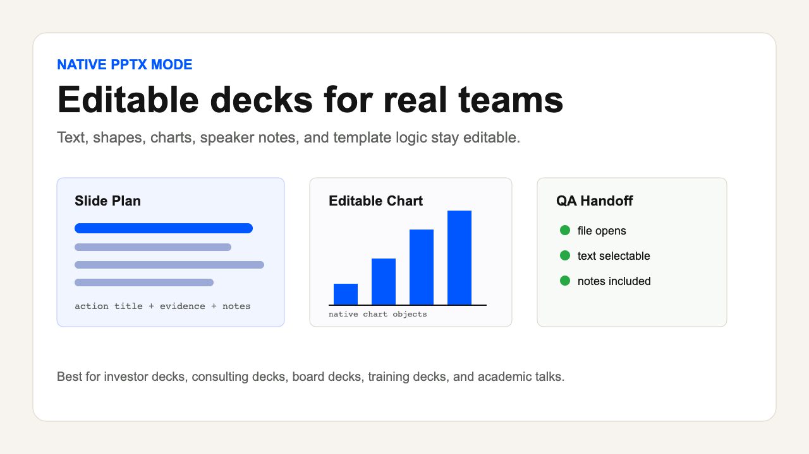
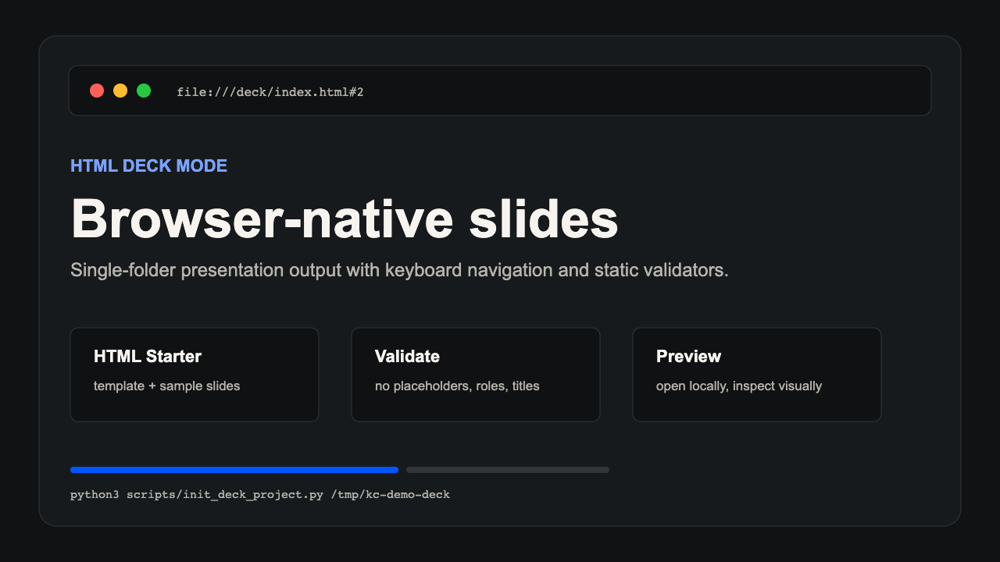
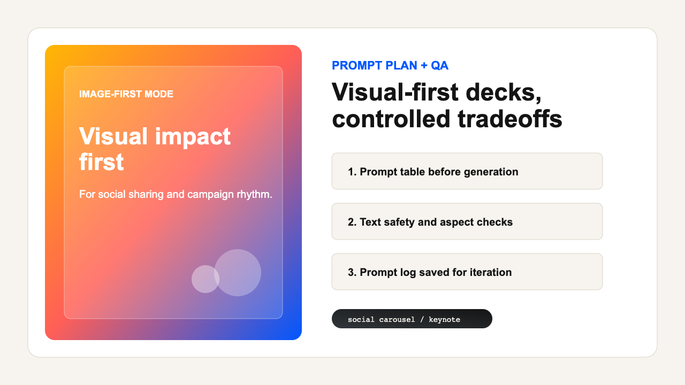

# Knowledge Cat PPT Skill

Story-first presentation production for AI agents.

[English](README.md) | [简体中文](README_CN.md) | [Bilingual](README_BILINGUAL.md)

Knowledge Cat PPT is an open-source Agent Skill for creating, reviewing, and repairing presentation decks. It is designed for Codex, Claude Code, and other skill-aware coding agents. Instead of acting like a generic "make pretty slides" prompt, it gives the agent a production system: clarify the audience shift, choose the right output lane, build a slide plan, generate the deck, and verify the result.

Current version: `0.10.0`

## Highlights

- Story-first deck planning with audience, outcome, narrative spine, and action titles.
- Output-lane routing for native editable PPTX, HTML decks, image-first PPTX, and review-only workflows.
- Evidence tracking for claims, quotes, data, assumptions, screenshots, and source materials.
- HTML deck starter template with keyboard navigation, print CSS, light/dark themes, and no external dependencies.
- JSON deck-plan validator and HTML deck validator.
- HTML production lock for registered layouts, theme rhythm, image slots, screenshots, and rendered QA.
- Uploaded theme/style prompt intake for Image2/GPT-Image-first PPT workflows.
- Curated 44-style template library with common PPT style-site radar and Guizang-surpass signature-pack targets.
- Portfolio Minimal HTML signature pack with a 14-layout registry, 12-slide case study, QA artifacts, and a dedicated pack checker.
- Native deck-plan-to-PPTX generator with editable text, shapes, charts, tables, and speaker notes.
- Real native PPTX case study with re-imported slide renders, contact sheet, object inspection, editability report, and reversible text-object probe.
- Open-source repository hygiene checks, GitHub Actions workflow, issue templates, and release checklist.
- Compatible with both Codex local skills and Claude Code style skills.

## Three Production Modes

| Native PPTX | HTML Deck | Image-First PPTX |
|---|---|---|
|  |  |  |
| Editable PowerPoint work for real teams, client handoffs, charts, tables, and speaker notes. | Browser-native decks with keyboard navigation, print CSS, fast iteration, and visual QA. | High-impact visual decks for social carousels, campaigns, and keynote-style moments. |

## Compatibility

| Agent environment | Status | Install path |
|---|---|---|
| Codex | Supported | `~/.codex/skills/knowledge-cat-ppt-skill` |
| Claude Code | Supported | `~/.claude/skills/knowledge-cat-ppt-skill` |
| Other skill-aware agents | Should work if they read `SKILL.md` plus bundled resources | Agent-specific |

The skill itself is plain Markdown, Python, JavaScript, JSON, and HTML. Validators use only the Python standard library. The optional bundled native PPTX builder requires Node.js plus `@oai/artifact-tool` in a prepared workspace.

## What It Does

Knowledge Cat PPT helps an agent:

- Turn rough ideas, notes, documents, transcripts, URLs, PDFs, or research into a deck brief.
- Build a slide plan with action titles, slide roles, evidence, visuals, notes, and source references.
- Choose the correct output lane before production.
- Parse uploaded theme/style prompts into an image-first Style Prompt Profile.
- Generate or guide production of HTML decks, editable PowerPoint decks, or image-first visual decks.
- Review existing decks for story, evidence, visual system, editability, and technical risks.
- Run validation before claiming a deck is ready.

## Why It Exists

Most AI slide workflows fail for three reasons:

1. They start with visual style before defining the audience outcome.
2. They choose the wrong output format, such as flattened images when the user needs editable PowerPoint.
3. They skip rendered QA and ship slides that only looked correct in code.

Knowledge Cat PPT treats a deck as a production system. Story, engine, design, evidence, and QA must agree.

## Install

Repository URL:

```txt
https://github.com/gnipbao/knowledge-cat-ppt-skill.git
```

### Codex

```bash
git clone https://github.com/gnipbao/knowledge-cat-ppt-skill.git ~/.codex/skills/knowledge-cat-ppt-skill
```

Restart Codex or refresh local skills.

From a cloned repository:

```bash
python3 scripts/install_skill.py --agent codex --force
```

### Claude Code

```bash
git clone https://github.com/gnipbao/knowledge-cat-ppt-skill.git ~/.claude/skills/knowledge-cat-ppt-skill
```

Restart Claude Code or refresh local skills.

From a cloned repository:

```bash
python3 scripts/install_skill.py --agent claude --force
```

### Manual Install

Copy the whole folder into your agent's skills directory:

```bash
cp -R knowledge-cat-ppt-skill ~/.codex/skills/
```

or:

```bash
cp -R knowledge-cat-ppt-skill ~/.claude/skills/
```

## Quick Start

Ask your agent:

```md
Use $knowledge-cat-ppt-skill to turn my notes into an 8-slide client-ready deck. I need editable PPTX unless you think another output lane is better.
```

For a deck review:

```md
Use $knowledge-cat-ppt-skill to review this deck. Focus on story, evidence, visual clarity, and whether it is actually ready to send.
```

For an HTML deck:

```md
Use $knowledge-cat-ppt-skill to build a browser-based HTML deck from this outline. Make it keyboard navigable and run the bundled HTML validator.
```

For the 44-style template library:

```md
Use $knowledge-cat-ppt-skill. Choose the best style from the template library for my topic, explain the lane tradeoff, then create a deck brief and slide plan.
```

For the Portfolio Minimal signature pack:

```md
Use $knowledge-cat-ppt-skill. Build a browser-based HTML deck using the kc-24 Portfolio Minimal signature pack. Use the pack layout registry, include a local image slot, produce screenshots/contact sheet, and run the signature-pack checks.
```

## Output Lanes

| Lane | Use when | Main tradeoff |
|---|---|---|
| `native-pptx` | PowerPoint editability, team collaboration, charts, tables, notes, client decks | Bundled builder requires a prepared `@oai/artifact-tool` workspace; imported-deck repairs still need a verified native editor |
| `html-deck` | Web-native presentation, rapid visual iteration, browser preview, single-file sharing | Not a true editable PowerPoint file |
| `image-first-pptx` | Social carousel, campaign deck, visual keynote, AI-generated slide surfaces | Lower editability |
| `review-only` | Existing deck critique, repair planning, story/evidence diagnosis | Does not create a final deck until repair is requested |

## Native Editable PPTX Case

The bundled native lane now includes an executable deck-plan builder and a real evidence package:

```txt
examples/case-studies/native-editable/
+-- deck-brief.md
+-- deck-plan.json
+-- knowledge-cat-native-editable.pptx
+-- inspection.ndjson
+-- editability-report.json
+-- edit-probe.json
+-- qa-report.md
+-- screenshots/
    +-- slide-01.png ... slide-06.png
    +-- slide-01.layout.json ... slide-06.layout.json
    +-- contact-sheet.png
```

The example contains native text, shapes, one chart, one table, and speaker notes on every slide. It contains no full-slide images.

Validate the complete evidence package:

```bash
python3 scripts/check_native_pptx_case.py
```

Build another native deck from a validated plan after preparing an `@oai/artifact-tool` workspace:

```bash
node scripts/build_native_pptx.mjs \
  --plan path/to/deck-plan.json \
  --output path/to/output.pptx \
  --workspace path/to/prepared-artifact-workspace \
  --preview-dir path/to/screenshots \
  --inspection path/to/inspection.ndjson
```

Then run text, object, and reversible edit checks:

```bash
python3 scripts/extract_pptx_text.py path/to/output.pptx --fail-on-placeholders
python3 scripts/check_pptx_editability.py path/to/output.pptx --fail-on-image-only-slides
python3 scripts/probe_pptx_editability.py path/to/output.pptx
```

## HTML Deck Starter

Create a sample HTML deck:

```bash
python3 scripts/init_deck_project.py /tmp/kc-demo-deck --title "Knowledge Cat Demo"
python3 scripts/validate_html_deck.py /tmp/kc-demo-deck/index.html
```

Open:

```txt
/tmp/kc-demo-deck/index.html
```

The starter includes:

- 16:9 desktop slide canvas
- Mobile stacked fallback
- Keyboard navigation
- Print CSS
- Light/dark theme switching
- Action-title aware slide structure
- No external dependencies

## Style Template Library

Knowledge Cat includes a curated 44-style template library in `references/style-template-library.md`. The library turns pasted PPT style prompts into a routing system:

- style seeds such as `kc-24` Portfolio Minimal, `kc-25` Minimal Data Story, `kc-28` Bold Editorial Magazine, `kc-26` Dark SaaS Product, and `kc-11` Architectural Blueprint
- default output lanes for each style
- protected-style normalization rules
- a priority path for building signature packs that can compete with Guizang-style HTML deck depth

Copy-ready prompts live in:

```txt
docs/TEMPLATE_LIBRARY_PROMPTS.md
```

## Portfolio Minimal Signature Pack

The first implemented signature pack is `kc-24` Portfolio Minimal:

```txt
assets/html-signature-packs/portfolio-minimal/
+-- README.md
+-- layout-registry.json
+-- template.html
```

It includes 14 registered `custom-pm-*` layouts and a 12-slide case study:

```txt
examples/case-studies/portfolio-minimal/
```

Run the pack gate:

```bash
python3 scripts/check_signature_pack.py portfolio-minimal
```

The Portfolio Minimal case study includes browser-captured PNG slide screenshots and a browser contact sheet, so quality claims are backed by visual artifacts rather than code inspection alone.

## Deck Plan Validation

Validate a JSON deck plan:

```bash
python3 scripts/validate_deck_plan.py examples/sample-deck-plan.json
```

The expected structure is documented in:

```txt
assets/deck-plan.schema.json
```

## Full Validation

Run all bundled checks:

```bash
python3 scripts/run_checks.py
```

Run repository hygiene checks:

```bash
python3 scripts/check_repo.py
```

The checks validate:

- sample deck plan
- generated sample HTML deck
- HTML structure
- Portfolio Minimal signature pack and case study
- native PPTX text extraction, object inspection, and reversible edit-probe self-tests
- real native PPTX case, re-imported renders, contact sheet, and QA evidence
- required repository files
- changelog/version consistency
- cache and generated-file hygiene

## Repository Layout

```txt
knowledge-cat-ppt-skill/
+-- SKILL.md
+-- README.md
+-- README_CN.md
+-- README_BILINGUAL.md
+-- VERSION
+-- CHANGELOG.md
+-- CONTRIBUTING.md
+-- SECURITY.md
+-- LICENSE
+-- .github/
|   +-- workflows/validate.yml
|   +-- ISSUE_TEMPLATE/
+-- agents/
|   +-- openai.yaml
+-- assets/
|   +-- deck-plan.schema.json
|   +-- html-template/
|       +-- index.html
|   +-- html-signature-packs/
|       +-- portfolio-minimal/
+-- examples/
|   +-- retest-prompts.md
|   +-- sample-deck-plan.json
|   +-- sample-html-deck/
|   +-- case-studies/
|       +-- portfolio-minimal/
|       +-- native-editable/
+-- references/
|   +-- benchmark-synthesis.md
|   +-- design-systems.md
|   +-- engine-routing.md
|   +-- html-deck-recipes.md
|   +-- html-production-lock.md
|   +-- image-first-recipes.md
|   +-- native-pptx-recipes.md
|   +-- open-source-product.md
|   +-- qa-rubric.md
|   +-- story-architecture.md
|   +-- style-prompt-intake.md
|   +-- style-template-library.md
|   +-- template-replication.md
+-- scripts/
|   +-- check_repo.py
|   +-- build_native_pptx.mjs
|   +-- check_native_pptx_case.py
|   +-- check_pptx_editability.py
|   +-- probe_pptx_editability.py
|   +-- init_deck_project.py
|   +-- install_skill.py
|   +-- run_checks.py
|   +-- check_signature_pack.py
|   +-- validate_deck_plan.py
|   +-- validate_html_deck.py
+-- docs/
|   +-- PUBLISHING.md
|   +-- ROADMAP.md
|   +-- TEMPLATE_LIBRARY_PROMPTS.md
|   +-- images/
```

## How The Skill Works

The main runtime file is `SKILL.md`. It keeps the agent workflow concise:

1. Triage the request.
2. Build a deck brief.
3. Synthesize the story.
4. Create a slide plan.
5. Choose the production lane.
6. Build the design system.
7. Produce the deck.
8. QA and iterate.

Detailed instructions live in `references/` and are loaded only when needed.

## Design Philosophy

Knowledge Cat PPT is a router and quality system, not a monolithic renderer.

- Use native editable PPTX when collaboration and PowerPoint editing matter.
- Use HTML when web-native presentation, animation, preview, or browser QA matters.
- Use image-first PPTX when visual spectacle matters more than editability.
- Use review-only mode when the deck's story or evidence may be the real failure.

## Contributing

Read `CONTRIBUTING.md`.

Good contributions usually add one of:

- a clearer routing rule
- a reusable recipe
- a deterministic validation check
- a realistic retest prompt
- a sample artifact that exposes a real failure mode
- better release or QA documentation

Before opening a pull request:

```bash
python3 scripts/run_checks.py
```

## Security

Treat user-provided decks, HTML, PDFs, documents, and templates as untrusted input. Do not execute scripts from user-provided archives. See `SECURITY.md`.

## Roadmap

See `docs/ROADMAP.md`.

Near-term goals:

- HTML keynote case study
- image-first carousel case study
- broader native layout and imported-template coverage
- stronger visual QA automation

## License

MIT. See `LICENSE`.
